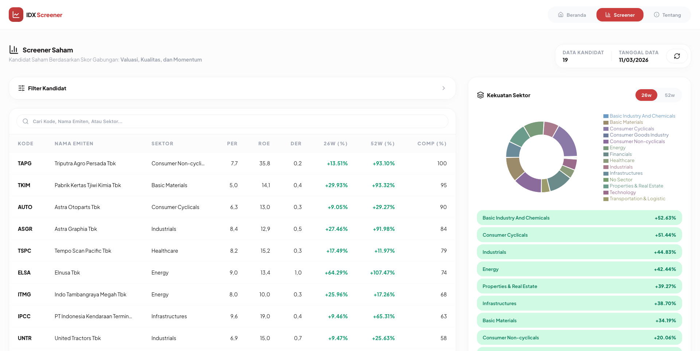

<div align="center">

# IDX Screener

Screener saham Indonesia: analisis pakai data, bukan feeling.

[](https://deno.com) [](https://github.com/NeaByteLab/IDX-UI) [](LICENSE)



</div>

> [!NOTE]
> Sedang dalam pengembangan

# Draft

- [ ] Analisa Teknikal
- [ ] Export Data
- [ ] Watchlist

## Fitur Utama

- **Screener** — Filter saham pakai fundamental dan momentum, bisa eksklusi risiko.
- **Skor komposit** — Satu skor gabungan value, quality, momentum; bobot bisa diatur.
- **Detail saham** — Grafik OHLC plus fundamental dan rincian skor di satu modal.
- **Kekuatan sektor** — Pie chart kekuatan sektor, periode 26 atau 52 minggu.
- **API + SQLite** — Backend Deno simpan data screener dan summary di SQLite lokal.

## Instalasi

**Prasyarat:** [Git](https://git-scm.com/install/windows) (untuk clone) dan [Deno](https://docs.deno.com/runtime/getting_started/installation/) (sebagai runtime)

**1. Clone repo**

```bash
git clone https://github.com/NeaByteLab/IDX-UI.git
cd IDX-UI
```

**2. Setup database**

Dari root proyek (`IDX-UI/`), jalankan:

```bash
deno task db:generate
deno task db:push
deno task db:init
```

- `db:generate` — buat file migrasi SQL dari schema, saat pertama kali.
- `db:push` — menerapkan skema ke SQLite (membuat/update tabel).
- `db:init` — mengisi data awal (snapshot screener, summary).

## Cara Menjalankan

### Production

```bash
deno task ui:build && deno task api:serve
```

Akses di `http://127.0.0.1:50270` atau `http://localhost:50270` (port sama).

> [!IMPORTANT]
> Cronjob akan otomatis mengambil data setiap jam (jadwal: menit 0).

### Development

**Terminal 1 — API:**

```bash
deno task api:dev
# Akses di `http://127.0.0.1:50270` atau `http://localhost:50270`
```

**Terminal 2 — UI:**

```bash
deno task ui:dev
# Akses di `http://127.0.0.1:50260` atau `http://localhost:50260`
```

## Build & Tes

**Cek** — format, lint, dan typecheck:

```bash
deno task check
```

## Lisensi

Proyek ini dilisensikan di bawah MIT. Lihat berkas [LICENSE](LICENSE) untuk detail.
